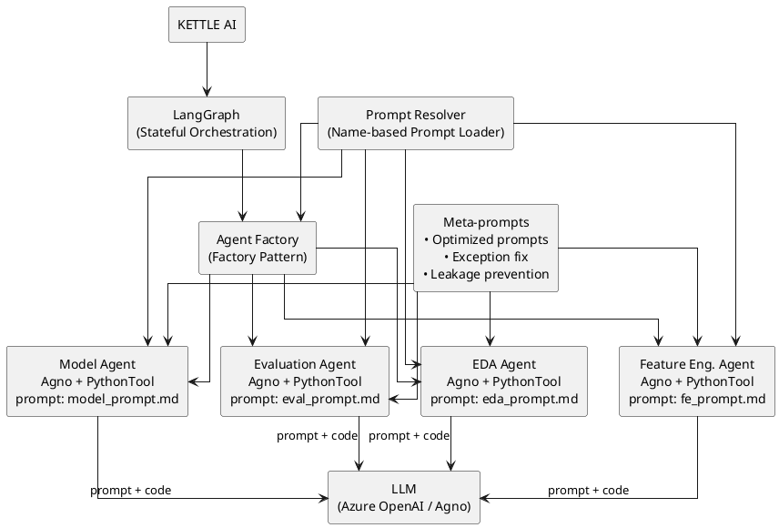

```plantuml
@startuml
skinparam defaultTextAlignment center
skinparam linetype ortho

rectangle "KETTLE AI" as KettleAI
rectangle "LangGraph\n(Stateful Orchestration)" as LangGraph
rectangle "Agent Factory\n(Factory Pattern)" as AgentFactory
rectangle "Prompt Resolver\n(Name-based Prompt Loader)" as PromptResolver
rectangle "Meta-prompts\n• Optimized prompts\n• Exception fix\n• Leakage prevention" as MetaPrompts
rectangle "LLM\n(Azure OpenAI / Agno)" as LLM

rectangle "EDA Agent\nAgno + PythonTool\nprompt: eda_prompt.md" as EDA
rectangle "Feature Eng. Agent\nAgno + PythonTool\nprompt: fe_prompt.md" as FE
rectangle "Model Agent\nAgno + PythonTool\nprompt: model_prompt.md" as Model
rectangle "Evaluation Agent\nAgno + PythonTool\nprompt: eval_prompt.md" as Eval

KettleAI --> LangGraph
LangGraph --> AgentFactory
AgentFactory --> EDA
AgentFactory --> FE
AgentFactory --> Model
AgentFactory --> Eval

PromptResolver --> AgentFactory
PromptResolver --> EDA
PromptResolver --> FE
PromptResolver --> Model
PromptResolver --> Eval

MetaPrompts --> EDA
MetaPrompts --> FE
MetaPrompts --> Model
MetaPrompts --> Eval

EDA --> LLM : prompt + code
FE --> LLM : prompt + code
Model --> LLM : prompt + code
Eval --> LLM : prompt + code

@enduml
```
