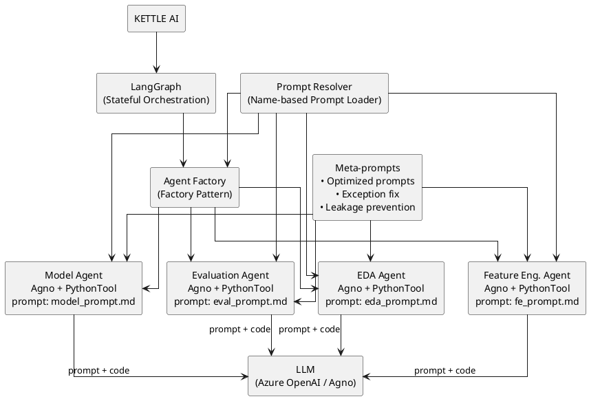

@startuml
skinparam dpi 150
skinparam componentStyle rectangle
skinparam rectangle {
  BorderColor #2F3B52
  FontSize 14
  Padding 10
}
skinparam ArrowColor #2F3B52
skinparam ArrowThickness 1

rectangle "User Query" as U
rectangle "LangGraph Orchestrator" as O
rectangle "Agent 1:\nData Retrieval" as A1
rectangle "Agent 2:\nProcessing / Reasoning" as A2
rectangle "Agent 3:\nOutput Formatting" as A3
rectangle "Final Response" as R

U -down-> O : handle_request(state) → state₀
O -down-> A1 : data_retrieval(state₀) → state₁
A1 -down-> A2 : process(state₁) → state₂
A2 -down-> A3 : format(state₂) → state₃
A3 -down-> R  : deliver(state₃) → response

' Example conditional/shortcut edge:
O -right-> A3 : bypass_if_cached(state₀) → state₃

note right of O
Each edge calls an agent method that
accepts a JSON `state` and returns
the updated state.
end note
@enduml

@startuml
skinparam dpi 150
skinparam componentStyle rectangle
skinparam rectangle {
  BorderColor #2F3B52
  FontSize 14
  Padding 10
}
skinparam ArrowColor #2F3B52
skinparam ArrowThickness 1
skinparam diamond {
  FontSize 14
  BorderColor #2F3B52
  BackgroundColor #F2F2F2
}

rectangle "User Query" as U
rectangle "LangGraph Orchestrator" as O
rectangle "Agent 1:\nData Retrieval" as A1
rectangle "Agent 2:\nProcessing / Reasoning" as A2
rectangle "Agent 3:\nOutput Formatting" as A3
rectangle "Final Response" as R

diamond "Cache Hit?" as D1
diamond "Valid Data?" as D2

U -down-> O : handle_request(state) → state₀
O -down-> D1

D1 -right-> A3 : yes → format(state₀) → state₃
D1 -down-> A1 : no → data_retrieval(state₀) → state₁

A1 -down-> D2
D2 -right-> A3 : yes → format(state₁) → state₃
D2 -down-> A2 : no → process(state₁) → state₂
A2 -down-> A3 : format(state₂) → state₃

A3 -down-> R : deliver(state₃) → response

note right of O
Each edge calls an agent method  
that accepts a JSON `state`  
and returns the updated state.
end note
@enduml

