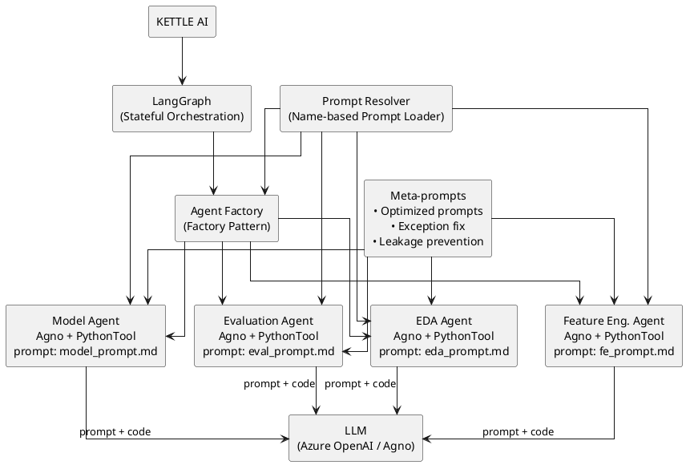

@startuml
skinparam dpi 150
skinparam componentStyle rectangle
skinparam rectangle {
  BorderColor #2F3B52
  FontSize 14
  Padding 10
}
skinparam ArrowColor #2F3B52
skinparam ArrowThickness 1

rectangle "User Query" as U
rectangle "LangGraph Orchestrator" as O
rectangle "Agent 1:\nData Retrieval" as A1
rectangle "Agent 2:\nProcessing / Reasoning" as A2
rectangle "Agent 3:\nOutput Formatting" as A3
rectangle "Final Response" as R

U -down-> O : handle_request(state) → state₀
O -down-> A1 : data_retrieval(state₀) → state₁
A1 -down-> A2 : process(state₁) → state₂
A2 -down-> A3 : format(state₂) → state₃
A3 -down-> R  : deliver(state₃) → response

' Example conditional/shortcut edge:
O -right-> A3 : bypass_if_cached(state₀) → state₃

note right of O
Each edge calls an agent method that
accepts a JSON `state` and returns
the updated state.
end note
@enduml

@startuml
skinparam dpi 150
skinparam componentStyle rectangle
skinparam rectangle {
  BorderColor #2F3B52
  FontSize 14
  Padding 10
}
skinparam ArrowColor #2F3B52
skinparam ArrowThickness 1
skinparam diamond {
  FontSize 14
  BorderColor #2F3B52
  BackgroundColor #F2F2F2
}

rectangle "User Query" as U
rectangle "LangGraph Orchestrator" as O
rectangle "Agent 1:\nData Retrieval" as A1
rectangle "Agent 2:\nProcessing / Reasoning" as A2
rectangle "Agent 3:\nOutput Formatting" as A3
rectangle "Final Response" as R

diamond "Cache Hit?" as D1
diamond "Valid Data?" as D2

U -down-> O : handle_request(state) → state₀
O -down-> D1

D1 -right-> A3 : yes → format(state₀) → state₃
D1 -down-> A1 : no → data_retrieval(state₀) → state₁

A1 -down-> D2
D2 -right-> A3 : yes → format(state₁) → state₃
D2 -down-> A2 : no → process(state₁) → state₂
A2 -down-> A3 : format(state₂) → state₃

A3 -down-> R : deliver(state₃) → response

note right of O
Each edge calls an agent method  
that accepts a JSON `state`  
and returns the updated state.
end note
@enduml

# pip install langgraph langchain  # (and optionally: pygraphviz + system graphviz)

from typing import Any, Dict

from langgraph.graph import StateGraph, START, END

State = Dict[str, Any]  # simple JSON-like state

# --- 1) Sample class: its methods will be used as nodes -----------------------

class DataAgent:

    def fetch(self, state: State) -> State:

        s = dict(state)

        q = s.get("query", "")

        # Simulate data fetch + a possible error if query contains "ERR"

        if "ERR" in q:

            s["error"] = f"Bad query: {q}"

            return s

        s["data"] = f"raw_data_for({q})"

        return s

    def process(self, state: State) -> State:

        s = dict(state)

        if not s.get("data"):

            s["error"] = "No data to process"

            return s

        s["data"] = str(s["data"]).upper()

        return s

    def format(self, state: State) -> State:

        s = dict(state)

        s["response"] = f"RESULT: {s.get('data', 'N/A')}"

        return s

    def handle_error(self, state: State) -> State:

        s = dict(state)

        msg = s.get("error", "Unknown error")

        s["response"] = f"ERROR: {msg}"

        # clear error if you want the flow to end cleanly

        # del s["error"]

        return s

agent = DataAgent()

# --- 2) Build the graph: nodes, entry, normal + conditional edges -------------

builder = StateGraph(State)  # plain dict state

# Add nodes from class methods

builder.add_node("fetch", agent.fetch)

builder.add_node("process", agent.process)

builder.add_node("format", agent.format)

builder.add_node("handle_error", agent.handle_error)

# Entry point

builder.set_entry_point("fetch")

# Normal edges

builder.add_edge("process", "format")

builder.add_edge("format", END)

builder.add_edge("handle_error", END)

# Conditional edges (INLINE lambdas): if state contains "error" go to handle_error

builder.add_conditional_edges(

    "fetch",

    lambda s: "handle_error" if "error" in s else "process",

    {"handle_error": "handle_error", "process": "process"},

)

builder.add_conditional_edges(

    "process",

    lambda s: "handle_error" if "error" in s else "format",

    {"handle_error": "handle_error", "format": "format"},

)

# --- 3) Compile & run ---------------------------------------------------------

app = builder.compile()

# Case A: normal flow

state_ok: State = {"query": "price of MSFT"}

final_ok = app.invoke(state_ok)

print("Final (OK):", final_ok["response"])

# Case B: error path (query triggers an error in fetch)

state_err: State = {"query": "ERR demo"}

final_err = app.invoke(state_err)

print("Final (ERR):", final_err["response"])

# --- 4) Visualize the graph ---------------------------------------------------

# Mermaid text (always works)

mermaid = app.get_graph().draw_mermaid()

with open("langgraph_flow.mmd", "w", encoding="utf-8") as f:

    f.write(mermaid)

print("Wrote Mermaid to langgraph_flow.mmd")

# Optional PNG (needs pygraphviz + system graphviz)

try:

    app.get_graph().draw_png("langgraph_flow.png")

    print("Wrote PNG to langgraph_flow.png")

except Exception as e:

    print("PNG export not available:", e)

    print("Tip: `npm i -g @mermaid-js/mermaid-cli` then:")

    print("  mmdc -i langgraph_flow.mmd -o langgraph_flow.png")

What to notice

Nodes are class methods (agent.fetch, agent.process, …).
State is a plain dict.
Inline conditional edges check if "error" in state to route to handle_error.
Exports Mermaid (.mmd) and tries to write a PNG if Graphviz is available.
