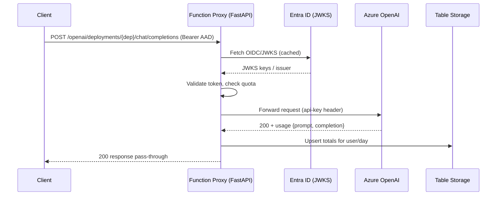

# Architecture Overview

## High-level

```mermaid
flowchart LR
    A[Client App / SDK<br/>(e.g., AzureOpenAI, LangGraph)] -->|Bearer AAD Token| B[Azure Function<br/>FastAPI Proxy]
    B -->|Validate JWT (aud, iss, sig)| C[Entra ID<br/>(JWKS/OIDC)]
    B -->|Forward Azure-style API| D[Azure OpenAI]
    B -->|Log per-user/day tokens| E[Azure Table Storage]
    B -->|Optional audit JSONL| F[Azure Blob Storage]
    B -->|Secrets (AOAI key)| G[Azure Key Vault]
    B -->|Metrics/Logs| H[App Insights]
```

**Key points:**
- The **Function App** hosts a **FastAPI** app via the **ASGI bridge**.
- **JWT validation** (issuer, audience, signature) is done for every request.
- **Forwarding** preserves Azure OpenAI path semantics.
- **Usage accounting** aggregates tokens per `user_id` and day.
- **Quotas** are enforced **pre-call** (block if already over) and finalized after reading `response.usage` (or estimating for streams).
- **Idempotent** usage updates via Table Storage upserts.

## Sequence (non-streaming)



## Data model (Table Storage)

- **PartitionKey** = `user_id`
- **RowKey** = `YYYYMMDD` for daily usage; optional `"quota"` row to store user-specific quota
- Attributes:
  - `prompt_tokens:int`
  - `completion_tokens:int`
  - `total_tokens:int`
  - `quota:int` (first write defaults from config)
  - `model:string` (last-used for the day)

## Compatibility

- Azure-style endpoints:
  - `/openai/deployments/{deployment}/chat/completions?api-version=...`
  - `/openai/deployments/{deployment}/embeddings?api-version=...`
- OpenAI-style convenience:
  - `/v1/chat/completions` (uses a default deployment, configurable in code)

Extend similarly for images/audio routes if needed.
