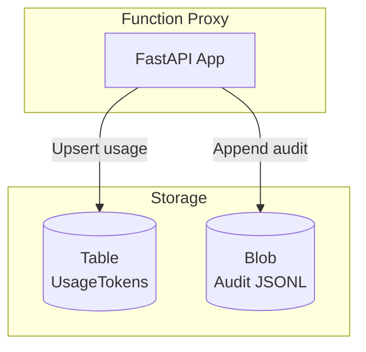

# Observability & Usage Accounting

## Storage

### Azure Table Storage

- **Table**: `USAGE_TABLE_NAME` (default `UsageTokens`)
- **PartitionKey**: user ID (`oid`, `sub`, or `preferred_username`)
- **RowKey**: `YYYYMMDD` (UTC day)
- **Columns**: `prompt_tokens`, `completion_tokens`, `total_tokens`, `quota`, `model`

### Optional: Blob audit

- **Container**: `AUDIT_BLOB_CONTAINER` (e.g., `auditlogs`)
- Write **JSONL** entries per request if enabled (redact secrets).

## Metrics

- Expose custom metrics via Application Insights (sample rates defined in `host.json`).
- Suggested custom properties on logs:
  - `correlationId`
  - `userId`
  - `deployment`
  - `model`
  - `promptTokens`
  - `completionTokens`
  - `totalTokens`
  - `overQuota`

## Diagrams

