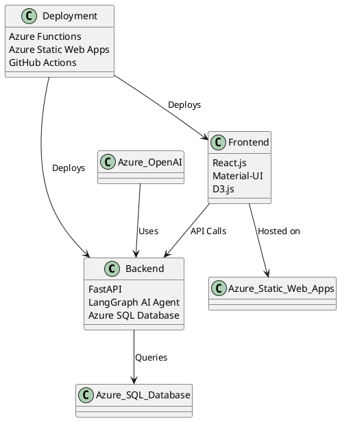

# Text-to-SQL Dashboard

A full-stack, context-aware Text-to-SQL solution built on Azure. The solution leverages:
- **Backend:** FastAPI wrapped in an Azure Function using a LangGraph AI Agent to convert natural language into SQL. It integrates with Azure OpenAI GPT-3.5 and Azure SQL Database.
- **Frontend:** A React.js admin dashboard using Material-UI for layout and D3.js for data visualizations. Authentication is handled by Azure Static Web Apps’ built-in Azure AD integration.
- **Deployment:** The backend is deployed as an Azure Function (Consumption Plan) and the frontend is hosted on Azure Static Web Apps. CI/CD is configured via GitHub Actions.

## Table of Contents

- [Features](#features)
- [Project Structure](#project-structure)
- [Backend Setup & Running Locally](#backend-setup--running-locally)
- [Frontend Setup & Running Locally](#frontend-setup--running-locally)
- [Deployment Instructions](#deployment-instructions)
- [CI/CD](#cicd)
- [Configuration](#configuration)
- [Contributing](#contributing)
- [License](#license)

## Features

- **Context-aware Text-to-SQL:** Uses Azure OpenAI GPT-3.5 via a LangGraph agent to convert natural language queries into SQL.
- **Static Schema Inference:** Loads the Azure SQL Database schema once on startup and caches it to optimize prompt creation.
- **Serverless Backend:** Deployed as an Azure Function on a consumption plan.
- **React Admin Dashboard:** Built with Material-UI for a modern, admin-style layout.
- **Data Visualizations:** D3.js is used to display query results as interactive charts.
- **Secure Authentication:** Azure Static Web Apps provides built-in Azure AD authentication for secure access.

## Project Structure

### Backend (`backend/`)
backend/
├── function_app.py         # FastAPI application entry point wrapped as an Azure Function
├── langgraph_agent.py      # LangGraph AI Agent that converts natural language to SQL
├── db_connector.py         # Executes SQL queries against the Azure SQL Database using pyodbc
├── schema_cache.py         # Loads and caches database schema from Azure SQL
├── requirements.txt        # Python dependencies
├── host.json               # Azure Functions host configuration
└── local.settings.json     # Local development settings (do not commit secrets)
### Frontend (`my-app/`)
my-app/
├── .github/
│   └── workflows/
│       └── azure-static-web-apps.yml   # GitHub Actions CI/CD workflow for Azure Static Web Apps
├── public/
│   ├── index.html                        # Main HTML file
│   └── staticwebapp.config.json          # SWA configuration for routing and authentication
├── src/
│   ├── api/
│   │   └── api.js                        # API communication module
│   ├── components/
│   │   ├── BarChart.js                   # D3.js bar chart component
│   │   ├── Chat.js                       # Chat interface for submitting queries
│   │   ├── ResultsTable.js               # Displays query results in a table
│   │   └── Sidebar.js                    # Navigation sidebar
│   ├── context/
│   │   ├── AuthContext.js                # Authentication context (handles login/logout)
│   │   └── QueryContext.js               # Query state management (history and selected query)
│   ├── pages/
│   │   ├── Dashboard.js                  # Main dashboard page combining all components
│   │   ├── Login.js                      # Login page for unauthenticated users
│   │   └── NotFound.js                   # 404 Page
│   ├── config/
│   │   └── settings.js                   # App configuration settings
│   ├── App.js                            # Main app component with routing
│   ├── App.css                           # Global styles
│   └── index.js                          # App entry point (bootstraps React)
└── package.json                          # Project configuration and dependencies

## Backend Setup & Running Locally

1. **Prerequisites:**
   - Python 3.8+
   - [Azure Functions Core Tools](https://learn.microsoft.com/azure/azure-functions/functions-run-local) (v4 recommended)
   - (Optional) Virtual environment

2. **Setup Steps:**
   - Navigate to the `backend/` folder.
   - Create and activate a virtual environment:
     ```bash
     python -m venv .venv
     source .venv/bin/activate   # On Windows: .venv\Scripts\activate
     ```
   - Install dependencies:
     ```bash
     pip install -r requirements.txt
     ```
   - Ensure `local.settings.json` is populated with your settings (e.g., `AZURE_OPENAI_ENDPOINT`, `AZURE_OPENAI_KEY`, `AZURE_OPENAI_DEPLOYMENT`, `DB_CONNECTION`).

3. **Run Locally:**
   - Start the Azure Functions runtime:
     ```bash
     func start
     ```
   - The function host will run (typically on `http://localhost:7071`). Test the API using a tool like `curl`:
     ```bash
     curl -X POST "http://localhost:7071/query" -H "Content-Type: application/json" -d '{"user_query": "What are the top 5 customers?"}'
     ```

## Frontend Setup & Running Locally

1. **Prerequisites:**
   - Node.js (v14 or later)
   - npm or yarn

2. **Setup Steps:**
   - Navigate to the frontend directory (`my-app/`).
   - Install dependencies:
     ```bash
     npm install
     ```
   - (Optional) Update the API base URL in `src/config/settings.js` if your backend is running separately.

3. **Run Locally:**
   - Start the development server:
     ```bash
     npm start
     ```
   - The app will be available at `http://localhost:3000`. Since Azure Static Web Apps’ built-in authentication is used, you can simulate login by accessing the `/.auth/me` endpoint (or deploy to see the full Azure AD auth flow).

## Deployment Instructions

### Deploying the Backend (Azure Functions)
1. Create an Azure Function App (Python, Consumption Plan) via the Azure Portal or CLI.
2. In the Function App’s configuration, add the necessary environment variables:
   - `AZURE_OPENAI_ENDPOINT`
   - `AZURE_OPENAI_KEY`
   - `AZURE_OPENAI_DEPLOYMENT`
   - `DB_CONNECTION`
3. Deploy the backend code using your preferred method:
   - **VS Code/Azure Functions Extension**: Right-click the project and select “Deploy to Function App.”
   - **GitHub Actions**: Commit your code to the repository. The GitHub Actions workflow (if configured for backend) will automatically deploy the changes.

### Deploying the Frontend (Azure Static Web Apps)
1. Create a new Azure Static Web App resource in the Azure Portal and link it to your GitHub repository.
2. Configure the build settings:
   - **App location:** `/` (or your React app folder)
   - **Output location:** `build` (for Create React App) or `dist` (for Vite)
   - **API location:** If your backend is separate, leave this blank.
3. Azure Static Web Apps will auto-generate a GitHub Actions workflow (or use the provided one in `.github/workflows/azure-static-web-apps.yml`) to build and deploy your frontend.
4. Push your changes to the repository. The workflow will run and deploy the latest version of your app.

## CI/CD

- **GitHub Actions:** The repository includes a workflow (`.github/workflows/azure-static-web-apps.yml`) that builds and deploys the frontend to Azure Static Web Apps on every push to the `main` branch.
- For the backend, you can set up a similar GitHub Actions workflow to deploy your Azure Functions code.

## Configuration

- **Environment Variables:**  
  - Backend: Configure in `local.settings.json` (for local development) and in the Azure Function App’s settings for production.
  - Frontend: Use environment variables (e.g., `REACT_APP_API_BASE_URL`) to override default API URLs if necessary.
- **Authentication:**  
  - Azure Static Web Apps handles Azure AD authentication. The `staticwebapp.config.json` file in `public/` enforces route protection and sets up login/logout routes.

## Architeture



## Contributing

Contributions are welcome! Please fork the repository and submit a pull request with your changes. For major changes, please open an issue first to discuss what you would like to change.

## Configure app registrations

https://learn.microsoft.com/en-us/entra/identity-platform/quickstart-configure-app-access-web-apis

## License

[MIT License](LICENSE)

