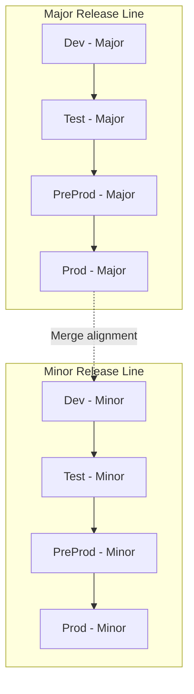
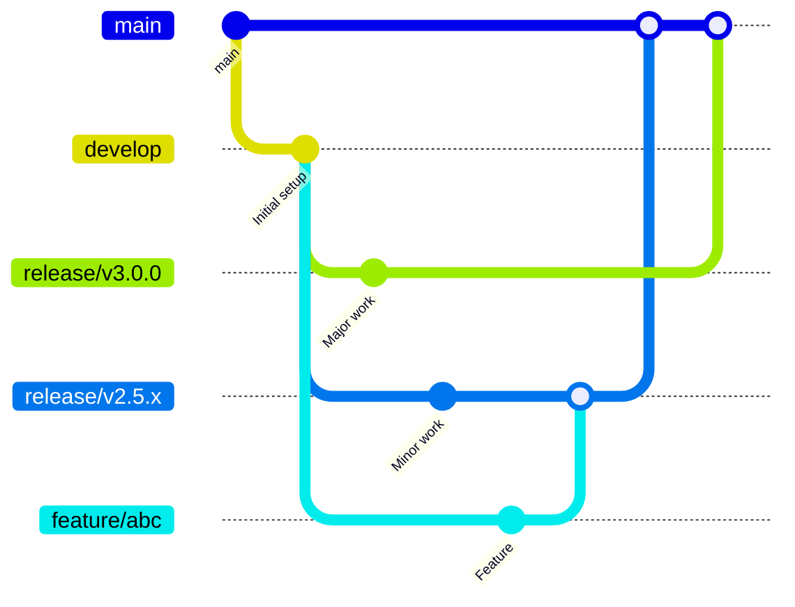
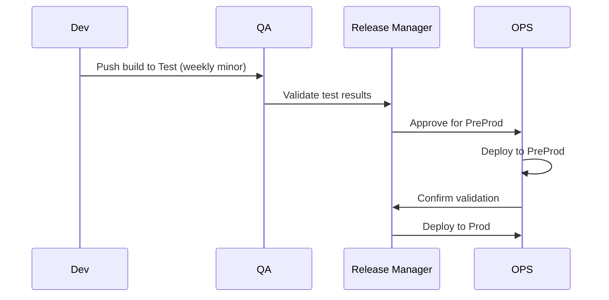
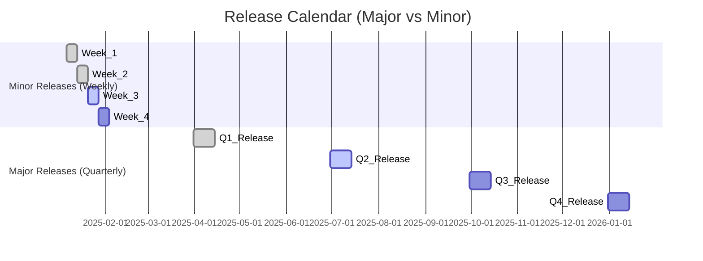

# Release Management Strategy
### Agile Weekly Minor Releases & Quarterly Major Releases  
**Model:** Release Flow Branching Strategy  
**Environments:** DEV → AIT → UAT → PRE-PROD → PROD  
**Governance:** CAB submission Monday → Deployment Friday

---

## 🎯 Objective
Deliver high-quality features and fixes **frequently and safely**, ensuring:
- One **minor release per week** (small stories, bug fixes, configuration changes).
- Two **major releases per quarter** (epics, architecture, data model updates).
- Full control through **CAB submission, test validation, and traceable promotion** across environments.
- **Continuous development** on `main`, while each release candidate is **frozen, validated, and auditable**.

---

## 🧩 Dual Environment Model — Minor vs Major Releases

To support **weekly minor releases** and **quarterly major releases** in parallel, maintain **two environment lines**:

| Line | Purpose | Description |
|------|----------|-------------|
| **Minor Release Line** | Continuous weekly delivery | Normal Release Flow through DEV → AIT → UAT → PRE-PROD → PROD |
| **Major Release Line** | Long-term validation for big upgrades | Parallel DEV-Major → AIT-Major → UAT-Major → PRE-PROD-Major → same PROD |

### Architecture Overview
```mermaid
flowchart LR
    subgraph LINE_A[Weekly Minor Release Line]
      A1[DEV (shared)] --> A2[AIT-Minor]
      A2 --> A3[UAT-Minor]
      A3 --> A4[PRE-PROD-Minor]
      A4 --> PROD[PRODUCTION]
    end

    subgraph LINE_B[Quarterly Major Release Line]
      B1[DEV-Major (release/v3.0)]
      B1 --> B2[AIT-Major]
      B2 --> B3[UAT-Major]
      B3 --> B4[PRE-PROD-Major]
      B4 --> PROD
    end

    A1 -. parallel development .-> B1
    PROD -->|Same live target| MON[Monitoring & Feedback]
```

### Benefits of Two Environment Lines
| Benefit | Description |
|----------|-------------|
| **No delivery blockage** | Minor weekly releases continue while major testing runs. |
| **Reduced CAB conflict** | Separate CAB submissions and evidence. |
| **Dedicated regression capacity** | Major track performs long regressions without delaying weekly deliveries. |
| **Shared PROD** | One production environment simplifies monitoring and release cadence. |
| **Shared DEV** | Developers can contribute to both trains efficiently. |

---

## 🗓️ Release Timelines (Generic)

### Weekly Minor Release Timeline

```mermaid
gantt
    title Weekly Minor Release Train (CAB Mon → Prod Fri)
    dateFormat  X
    axisFormat %L
    excludes weekends

    section Minor Release
    Dev & Integration (main)          :done, m1, 0, 3d
    Cut release/YYYY.MM.DD + CAB Mon  :m2, after m1, 1d
    UAT-Minor                         :m3, after m2, 3d
    Pre-Prod-Minor                    :m4, after m3, 1d
    Friday Prod Deploy (Minor)        :m5, after m4, 1d
    Post-Release Monitoring           :m6, after m5, 1d
```


### Quarterly Major Release Timeline

```mermaid
gantt
    title Quarterly Major Release Train
    dateFormat  X
    axisFormat %L
    excludes weekends

    section Major Release
    Major Dev (release/v3.0)          :done, maj1, 0, 10d
    AIT-Major / Integration           :maj2, after maj1, 10d
    UAT-Major & Extended Tests        :maj3, after maj2, 10d
    Pre-Prod-Major & CAB Approval     :maj4, after maj3, 5d
    Major Prod Deploy (Quarterly)     :maj5, after maj4, 1d
    Stabilization & Post-Prod Review  :maj6, after maj5, 3d
```


---

## 🔧 How the Lines Work Together
1. **Minor releases** use `main` and weekly `release/YYYY.MM.DD` branches.  
2. **Major release** (e.g., `release/v3.0`) evolves in parallel with its own testing environments.  
3. Before go-live:
   - Minor releases pause for 1–2 weeks.
   - Final UAT + PRE-PROD validation on major track.
   - CAB approves the major deployment window.
4. After go-live:
   - Merge the major branch back into `main`.
   - Resume weekly release cadence.

---

## ✅ Key Recommendations
- Maintain **two environment lines**: one for **weekly minor**, one for **quarterly major** releases.
- Use **shared DEV and PROD**, separate **AIT, UAT, PRE-PROD**.
- Keep **synchronized data** between pre-prod environments.
- Align CAB approvals to avoid overlaps.
- Major release CAB includes rollback & comms plan.

---

## 📘 Summary
This dual-line approach enables:
- Continuous weekly value delivery.
- Long-running validation for major changes.
- Separate testing tracks, shared production.
- Lower risk, higher speed, clear governance.

  #######################


  ---
title: "Operational Release Management Strategy"
description: "Comprehensive guide for managing weekly minor and quarterly major releases with dual environment lines and structured branching strategy."
---

# Operational Release Management Strategy

This document provides a complete operational framework for managing software releases across multiple environments using two parallel release lines: **Major** and **Minor**. It defines cadence, environment flow, branching model, testing stages, governance, rollback, and communication procedures.

---

## 1. Release Cadence and Definition

| Release Type | Frequency | Purpose | Example Version |
|---------------|------------|----------|------------------|
| **Minor Release** | Weekly | Delivery of incremental features, fixes, and patches | `v2.4.1` |
| **Major Release** | Quarterly | Delivery of structural changes, new modules, architecture upgrades | `v3.0.0` |

### 1.1 Objectives

- Ensure stability in production through predictable, tested deployments.
- Allow continuous delivery without blocking long-term development.
- Maintain quality assurance gates for each line independently.

---

## 2. Environment Model — Two Parallel Lines

To support stability and innovation simultaneously, two environment lines are maintained:

- **Line A (Major Release Line):** used for large-scale changes, long QA cycles, and architecture upgrades.  
- **Line B (Minor Release Line):** used for weekly feature releases and fixes.

### 2.1 Environment Flow Diagram



### 2.2 Environment Responsibilities

| Environment | Purpose | Owner | Notes |
|--------------|----------|--------|--------|
| **Dev** | Early integration, developer testing | Development Team | CI build validation |
| **Test** | QA functional and regression testing | QA Team | Automated + manual tests |
| **PreProd** | Final validation with production-like data | Release Management | Sanity, performance, UAT |
| **Prod** | Live environment | Ops / SRE | Final monitored deployment |

---

## 3. Branching Strategy

The branching model ensures clear isolation between feature development, minor updates, and major releases.



### 3.1 Branch Types

| Branch | Purpose | Merge Target |
|---------|----------|--------------|
| **main** | Production-ready code | — |
| **develop** | Active development for upcoming minor releases | `release/vX.Y.x` |
| **release/vX.Y.x** | Stabilization branch for a specific release | `main` |
| **feature/** | New features or fixes | `develop` |
| **hotfix/** | Urgent fixes for production | `main` and back-merged to `develop` |
| **major/** | Structural changes for next quarterly release | `release/vX+1.0.0` |

### 3.2 Rules

- Feature branches must merge into `develop` only after successful pipeline checks.  
- Minor releases are tagged weekly from the latest stable release branch.  
- Major releases are branched from `main` quarterly.  
- Merge conflicts between major and minor lines are resolved during synchronization windows.  

---

## 4. Testing and Quality Assurance

| Stage | Responsibility | Test Type | Automation |
|--------|----------------|------------|-------------|
| **Dev** | Developers | Unit Tests | ✅ |
| **Test** | QA Team | Integration, Regression | ✅ |
| **PreProd** | Release Team | UAT, Performance | ⚙️ Partial |
| **Prod** | Ops/SRE | Smoke, Monitoring Validation | ✅ |

### 4.1 Quality Gates

- Static code analysis (SonarQube, linting)
- Vulnerability scanning (Snyk, Trivy)
- Automated test pass ≥ 90%
- Performance threshold deviation < 10%
- Security approval prior to promotion

---

## 5. Promotion and Deployment Flow



- All deployments follow automated pipelines (CI/CD).  
- Approvals required for promotion between stages.  
- Deployment artifacts versioned and immutable.  

---

## 6. Rollback and Contingency

- **Automated rollback:** via deployment history (e.g., Helm rollback, GitLab environments).  
- **Manual rollback:** follow change management procedure.  
- **Root cause analysis:** mandatory for all failed deployments.  
- **Rollback testing:** quarterly simulation to ensure process readiness.

---

## 7. Governance and Communication

| Phase | Communication Channel | Owner | Artifacts |
|--------|------------------------|--------|------------|
| Pre-Release | Confluence / Teams | Release Manager | Release Notes |
| Post-Deployment | Email / ChatOps | Ops Team | Incident Summary |
| Quarterly Planning | Management Review | PMO | Roadmap, KPIs |

---

## 8. Timeline Overview



---

## 9. Continuous Improvement

- Conduct release retrospectives after every major deployment.  
- Review and update branching rules quarterly.  
- Automate regression tests and performance benchmarks continuously.  
- Maintain feedback loop from users to prioritize post-release fixes.

---

## 10. Summary

This strategy balances **speed and stability** by separating release lines, enforcing structured branching, and ensuring strong QA governance. It supports continuous delivery for weekly improvements while enabling predictable quarterly milestones for major evolution.


