# Release Management Strategy
### Agile Weekly Minor Releases & Quarterly Major Releases  
**Model:** Release Flow Branching Strategy  
**Environments:** DEV → AIT → UAT → PRE-PROD → PROD  
**Governance:** CAB submission Monday → Deployment Friday

---

## 🎯 Objective
Deliver high-quality features and fixes **frequently and safely**, ensuring:
- One **minor release per week** (small stories, bug fixes, configuration changes).
- Two **major releases per quarter** (epics, architecture, data model updates).
- Full control through **CAB submission, test validation, and traceable promotion** across environments.
- **Continuous development** on `main`, while each release candidate is **frozen, validated, and auditable**.

---

## 🧩 Dual Environment Model — Minor vs Major Releases

To support **weekly minor releases** and **quarterly major releases** in parallel, maintain **two environment lines**:

| Line | Purpose | Description |
|------|----------|-------------|
| **Minor Release Line** | Continuous weekly delivery | Normal Release Flow through DEV → AIT → UAT → PRE-PROD → PROD |
| **Major Release Line** | Long-term validation for big upgrades | Parallel DEV-Major → AIT-Major → UAT-Major → PRE-PROD-Major → same PROD |

### Architecture Overview
```mermaid
flowchart LR
    subgraph LINE_A[Weekly Minor Release Line]
      A1[DEV (shared)] --> A2[AIT-Minor]
      A2 --> A3[UAT-Minor]
      A3 --> A4[PRE-PROD-Minor]
      A4 --> PROD[PRODUCTION]
    end

    subgraph LINE_B[Quarterly Major Release Line]
      B1[DEV-Major (release/v3.0)]
      B1 --> B2[AIT-Major]
      B2 --> B3[UAT-Major]
      B3 --> B4[PRE-PROD-Major]
      B4 --> PROD
    end

    A1 -. parallel development .-> B1
    PROD -->|Same live target| MON[Monitoring & Feedback]
```

### Benefits of Two Environment Lines
| Benefit | Description |
|----------|-------------|
| **No delivery blockage** | Minor weekly releases continue while major testing runs. |
| **Reduced CAB conflict** | Separate CAB submissions and evidence. |
| **Dedicated regression capacity** | Major track performs long regressions without delaying weekly deliveries. |
| **Shared PROD** | One production environment simplifies monitoring and release cadence. |
| **Shared DEV** | Developers can contribute to both trains efficiently. |

---

## 🗓️ Release Timelines (Generic)

### Weekly Minor Release Timeline

```mermaid
gantt
    title Weekly Minor Release Train (CAB Mon → Prod Fri)
    dateFormat  X
    axisFormat %L
    excludes weekends

    section Minor Release
    Dev & Integration (main)          :done, m1, 0, 3d
    Cut release/YYYY.MM.DD + CAB Mon  :m2, after m1, 1d
    UAT-Minor                         :m3, after m2, 3d
    Pre-Prod-Minor                    :m4, after m3, 1d
    Friday Prod Deploy (Minor)        :m5, after m4, 1d
    Post-Release Monitoring           :m6, after m5, 1d
```


### Quarterly Major Release Timeline

```mermaid
gantt
    title Quarterly Major Release Train
    dateFormat  X
    axisFormat %L
    excludes weekends

    section Major Release
    Major Dev (release/v3.0)          :done, maj1, 0, 10d
    AIT-Major / Integration           :maj2, after maj1, 10d
    UAT-Major & Extended Tests        :maj3, after maj2, 10d
    Pre-Prod-Major & CAB Approval     :maj4, after maj3, 5d
    Major Prod Deploy (Quarterly)     :maj5, after maj4, 1d
    Stabilization & Post-Prod Review  :maj6, after maj5, 3d
```


---

## 🔧 How the Lines Work Together
1. **Minor releases** use `main` and weekly `release/YYYY.MM.DD` branches.  
2. **Major release** (e.g., `release/v3.0`) evolves in parallel with its own testing environments.  
3. Before go-live:
   - Minor releases pause for 1–2 weeks.
   - Final UAT + PRE-PROD validation on major track.
   - CAB approves the major deployment window.
4. After go-live:
   - Merge the major branch back into `main`.
   - Resume weekly release cadence.

---

## ✅ Key Recommendations
- Maintain **two environment lines**: one for **weekly minor**, one for **quarterly major** releases.
- Use **shared DEV and PROD**, separate **AIT, UAT, PRE-PROD**.
- Keep **synchronized data** between pre-prod environments.
- Align CAB approvals to avoid overlaps.
- Major release CAB includes rollback & comms plan.

---

## 📘 Summary
This dual-line approach enables:
- Continuous weekly value delivery.
- Long-running validation for major changes.
- Separate testing tracks, shared production.
- Lower risk, higher speed, clear governance.
